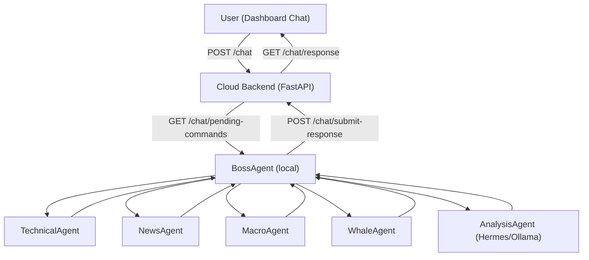
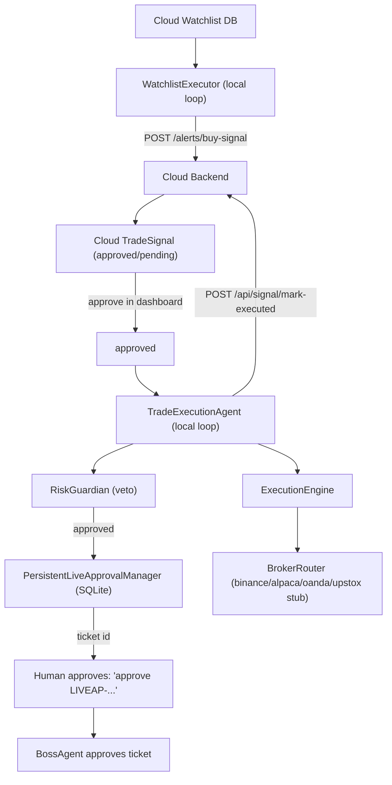
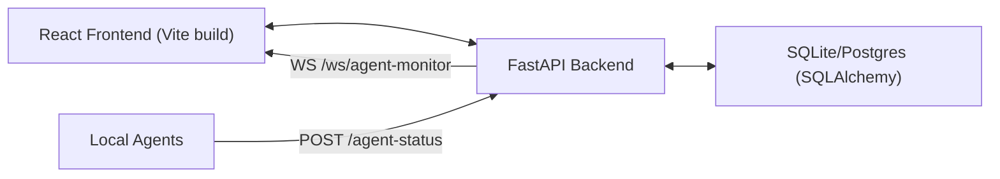

# ULTRA MASTER SYSTEM CONTEXT (Reverse Engineered)

Generated: 2026-05-25 (Asia/Calcutta)
Last Updated: 2026-05-27 (Asia/Calcutta)

Scope: This document reconstructs the *implemented* system found on disk in:

- `C:\Users\ambat\Documents\Codex\2026-05-18\files-mentioned-by-the-user-multi\trading_system`
- `...\trading_system\trading-dashboard` (cloud dashboard repo deployed on Render)

Accuracy policy:
- **VERIFIED IMPLEMENTATION**: confirmed by file existence + code inspection in this workspace.
- **INFERRED IMPLEMENTATION**: inferred from naming, partial code, or runtime/log evidence.
- **PARTIAL IMPLEMENTATION**: exists but incomplete / stubbed / not production complete.
- **MISSING IMPLEMENTATION**: requested in conversation but not present in code.

No systems/files are invented. When uncertain, it is labeled explicitly.

---

## CHANGELOG (Session Addenda)

### 2026-05-27 Addendum (VERIFIED): Dashboard "Phase A Foundation" Rollout + Render Stabilization
This session implemented and deployed a set of "Phase A" execution-safety building blocks in the **cloud dashboard repo**
(`trading-dashboard/`) and resolved multiple Render deploy failures. These changes are **verified on disk** in the repo and
were deployed via successive GitHub pushes (Render auto-deploy).

Key themes:
- Render default Python version drift required pinning Python 3.11.
- SQLite schema/index drift required removing duplicate index declarations and adding a boot-safety guard.
- Dataclass `slots=True` required explicit field declarations for attributes set during `__post_init__`.
- Frontend build behavior on Render was inconsistent with expectations; a "no-rebuild" **UI hotfix injector** was added to
  `frontend/dist/index.html` so the Kill Switch UI can appear even when the TS bundle isn't rebuilt.

## 1. COMPLETE SYSTEM OVERVIEW

### VERIFIED IMPLEMENTATION: What The System Actually Is
This workspace contains **two related systems**:

1. **Local Multi-Agent Trading OS** (runs on the user's laptop)
   - Python multi-agent system implementing:
     - Boss/orchestrator agent
     - Specialist research agents (technical, whale, macro, news)
     - PineScript strategy generator agent (LLM-assisted)
     - Learning/analysis agents (AnalysisAgent, BacktestingAgent)
     - Execution pipeline: RiskGuardian → ExecutionEngine → Paper/Live executor → BrokerRouter
     - Memory: local SQLite repositories + in-memory state + lightweight vector memory
     - Telegram webhook endpoint (local) for command relay
   - Primary entrypoint: `main.py` (FastAPI app factory) and also individual `agents/*.py` runners.

2. **Cloud Trading Dashboard** (deployed on Render)
   - A combined React frontend + FastAPI backend.
   - Provides:
     - Chat UI (command queue + responses)
     - Agent monitor (websocket)
     - Trading/Strategies/Backtesting/Screener/Settings/Watchlist/Signals pages
     - Simple DB-backed watchlist + signal approval storage (SQLite or Postgres via `DATABASE_URL`)
   - Repo root: `trading-dashboard/`
   - Deployment: Render auto-deploy on GitHub push.
   - Live URL (from env/docs): `https://my-trading-dashboard-8.onrender.com`

### VERIFIED IMPLEMENTATION: Designed To Do
Overall system goal:
- Enable a human-in-the-loop trading workflow where a **cloud dashboard** collects user commands and shows system state, while **local agents** fetch real data and do analysis/backtesting/strategy generation, and optionally execute trades (paper/live with strict gating).

### Architectural Philosophy / Engineering Principles (VERIFIED + INFERRED)
- **Risk-first, veto-based execution**: `RiskGuardian` can reject any order before it reaches brokers.
- **Isolation by mode**: `TradingMode` enum: `paper`, `live`, `backtest`. Backtest cannot execute trades; paper cannot hit brokers; live requires explicit approval.
- **Event-driven internal plumbing**: `AsyncEventBus` publishes typed events (risk approved/rejected, trade executed, kill switch triggered).
- **Separation of concerns**:
  - Skills: pure-ish computation/data fetching (`skills/`)
  - Agents: coordination + decision logic (`agents/`)
  - Execution: broker routing + approvals (`execution/`)
  - Memory: persistence and state snapshots (`memory/`)
  - APIs: FastAPI routers (`api/`)
  - Cloud dashboard: separate runtime and persistence boundary (`trading-dashboard/`)
- **Local models for reasoning** (conversation requirement): Ollama is used for reasoning/LLM tasks; real market data is fetched via APIs (yfinance/ccxt/etc).

### Current Maturity Level (VERIFIED)
- Cloud dashboard is functional and deployed, but deployment stability required changes:
  - Render blueprint was adjusted to be more robust (see `trading-dashboard/render.yaml`, `trading-dashboard/build.sh`).
- Local multi-agent system is functional for analysis/backtest/pinescript generation and dashboard chat integration, but:
  - Hermes integration is **present but operationally sensitive** (WSL/SSH path and auth).
  - Live execution supports Binance/Alpaca/OANDA; **Upstox is stubbed**.
  - Some workflows depend on the cloud dashboard being reachable; connectivity errors can degrade user experience.

### Intended Production Scale (INFERRED)
This system is built for a single operator (you) and a single dashboard instance, with the ability to add more symbols/strategies and more agents. It is not (yet) designed for multi-tenant use, high-frequency trading, or regulated execution with exchange-grade compliance.

---

## 2. COMPLETE TECH STACK ANALYSIS

This section lists technologies found in the repositories and what they do here.

### Frontend (Cloud Dashboard)
- **React 18 + TypeScript + Vite** (VERIFIED: `trading-dashboard/frontend`)
  - Purpose: SPA dashboard UI.
  - Advantages: fast dev + strong TS typing.
  - Disadvantages: needs build pipeline; deployed as static `dist/`.
  - Integration: fetch calls to backend endpoints; websocket for agent monitor.
- **Tailwind CSS** (VERIFIED by code usage)
  - Purpose: consistent dark theme and layout.
  - Impact: fast iteration; relies on build tooling for CSS.
- **Recharts** (VERIFIED by components e.g. `BacktestingPage.tsx`, `StrategiesPage.tsx`)
  - Purpose: charts for equity curves and metrics.
  - Tradeoffs: client-side rendering and potential perf issues for huge series.

### Cloud Backend (Dashboard)
- **FastAPI** (VERIFIED: `trading-dashboard/backend/main.py`)
  - Purpose: API endpoints, websocket endpoint, serving static frontend.
  - Integration: receives agent status updates; stores chat commands; serves watchlist/signals; provides mocks for trading pages.
- **WebSockets** (VERIFIED: `/ws/agent-monitor`)
  - Purpose: real-time agent monitor updates in UI.
  - Impact: simple push-based state; needs connection handling.
- **SQLAlchemy** (VERIFIED: `trading-dashboard/backend/database.py`)
  - Purpose: DB models and persistence for watchlist + signals + alerts + strategies + etc.
  - Deployment: SQLite in dev; Postgres supported via `DATABASE_URL` fix.

### Local Agent System (Trading OS)
- **FastAPI** (VERIFIED: `main.py` / `api/*`)
  - Purpose: local API for orders/backtests/risk snapshot + telegram webhook.
  - Note: this is separate from cloud dashboard backend.
- **asyncio** (VERIFIED across agents and event bus)
  - Purpose: concurrency and background loops.
- **aiohttp** (VERIFIED dependency, used in broker adapters and telegram send)
  - Purpose: async HTTP calls.
- **yfinance** (VERIFIED: skills/agents)
  - Purpose: market data and news fallback.
  - Risk: rate limits, occasional MultiIndex column shapes.
- **pandas** (VERIFIED: `skills/technical_analysis_skill.py`)
  - Purpose: indicator computation.
- **ccxt (async_support)** (VERIFIED: `execution/broker_router.py`)
  - Purpose: Binance live execution via exchange API.
  - Tradeoffs: heavy dependency; needs API keys; error-prone; network sensitive.
- **Ollama (local LLM)** (VERIFIED by env + code: `boss_agent.py` and `skills/pinescript_strategy_generator.py`)
  - Purpose: reasoning / text generation tasks.
  - Integration: HTTP calls to `OLLAMA_URL`.
  - Operational impact: needs ollama server running; can be slow on low RAM.
- **Hermes Agent** (VERIFIED integration wrapper: `integrations/hermes_client.py`)
  - Purpose: additional reasoning + self-learning copilot.
  - Integration: via CLI shellout (WSL or SSH).
  - Operational risk: PATH issues, WSL/SSH configuration, non-interactive environment.

### Databases / Storage (Local)
- **SQLite** (VERIFIED usage in `memory/trade_memory.py`, `memory/reflexion_memory.py`, persistent live approval DB)
  - Purpose: persistent storage of:
    - trade execution audit trail
    - reflexion/lessons
    - approval tickets (to share between processes)
- **VectorMemory (in-memory)** (VERIFIED: `memory/vector_memory.py`)
  - Purpose: local vector storage; likely lightweight embeddings placeholder.
  - Status: present; embeddings pipeline not fully defined in this session.

### Deployment
- **Render** (VERIFIED: `trading-dashboard/render.yaml`, `build.sh`)
  - Purpose: cloud hosting of dashboard.
  - Integration: GitHub auto-deploy.
  - Known fragility: runtime environment selection (node vs python) and frontend build.

---

## 3. COMPLETE AI SYSTEM REVERSE ENGINEERING (The “Brain”)

This is a multi-agent *workflow system*, not a single monolithic agent. Reasoning is split across:

- Boss orchestration logic
- Specialist agents returning structured results
- Optional LLM/Hermes summarization and iterative tuning
- Risk/Execution gates that prevent unsafe actions

### VERIFIED IMPLEMENTATION: Core Reasoning Flow
In local system `agents/boss_agent.py`, the Boss agent:
1. Receives a user command (polled from cloud dashboard).
2. Parses intent via `skills/chatbot_command_parser.py`:
   - regex-based parsing
   - intents: analyze, backtest, place_order, whale_activity, current_risk, approve_live, unknown
3. Resolves symbol phrases via `skills/symbol_resolver.py`.
4. Builds a “plan” (a dict returned to caller; not a formal planning framework).
5. Delegates to specialist agents for data:
   - TechnicalAnalysisAgent (calls TechnicalAnalysisSkill; yfinance indicators)
   - NewsSentimentAgent (calls NewsIntelligenceSkill; NewsAPI or yfinance)
   - MacroIntelligenceAgent (yfinance macro tickers)
   - WhaleIntelligenceAgent (calls WhaleTrackerSkill)
6. Performs basic sanity checks (VERIFIED in code via fallback behavior and type conversions).
7. Calls AnalysisAgent to turn the data bundle into a report (Hermes-assisted if Hermes works; otherwise local fallback behavior depends on agent code).
8. Stores “reflexion entry” in local SQLite for future reuse (`memory/reflexion_memory.py`).
9. Sends response back to cloud dashboard via `/chat/submit-response`.

### Verified LLM / Model Routing
- BossAgent includes an `OllamaClient` class that calls:
  - `POST {OLLAMA_URL}/api/generate` with `{model, prompt, stream:false}`
  - fallback model if primary fails
- PineScript generation uses `skills/pinescript_strategy_generator.py` which implements a router (`MultiModelRouter`) reading `config/settings.py` model routing settings.

### Hallucination Reduction / Validation (PARTIAL)
There is no dedicated “truth enforcement” framework. Instead:
- Data is fetched from APIs and structured into dicts.
- Some type coercions and shape normalization exist (e.g. yfinance MultiIndex close series conversion in `technical_analysis_skill.py` and macro agent).
- Execution path is validated by strict model validators (`pydantic` in `config/models.py`).
- RiskGuardian imposes mandatory stop loss and exposure constraints.

### Retry Logic / Failure Handling (VERIFIED)
Multiple layers:
- BrokerRouter has a retry policy and backoff.
- Agents wrap loops in try/except and post error status.
- HermesClient returns sentinel strings on timeout/errors.
- NewsAPI calls now have a short timeout + fallback.

### Context Building / Memory Use (PARTIAL)
- BossAgent stores reflexion entries after analyze/backtest.
- There is no verified retrieval/ranking pipeline used for every command (some repos exist but not confirmed integrated into Boss flow beyond “store entry”).

---

## 4. COMPLETE MULTI-AGENT SYSTEM ANALYSIS

### VERIFIED AGENT LIST (Local)
Location: `agents/`

- `BossAgent` (`agents/boss_agent.py`)
- `TechnicalAnalysisAgent` (`agents/technical_agent.py`)
- `NewsSentimentAgent` (`agents/news_agent.py`)
- `MacroIntelligenceAgent` (`agents/macro_agent.py`)
- `WhaleIntelligenceAgent` (`agents/whale_agent.py`)
- `PineScriptGenerationAgent` (`agents/pinescript_agent.py`)
- `AnalysisAgent` (`agents/analysis_agent.py`)
- `BacktestingAgent` (`agents/backtesting_agent.py`)
- `HermesAdvisorAgent` (`agents/hermes_advisor_agent.py`)
- `ReflexionAgent` (`agents/reflexion_agent.py`) (present, not deeply analyzed here)
- `RiskGuardian` (`agents/risk_guardian.py`) (acts as a “policy agent”)
- `WatchlistExecutor` (`agents/watchlist_executor.py`)
- `TradeExecutionAgent` (`agents/trade_execution_agent.py`)
- `orchestration_runner.py` (runs multiple agents concurrently in one process; used for dev)

#### BossAgent
- Role: Orchestrator / planner / validator / persistence.
- Inputs: chat commands (cloud dashboard queue).
- Outputs: response text to dashboard, reflexion entries, approvals for live tickets.
- Tools:
  - HTTP polling/posting to dashboard endpoints
  - calls to other local agents (method calls)
  - HermesClient + OllamaClient
  - SQLite reflexion repository
- Lifecycle: infinite poll loop in `__main__`.

#### TechnicalAnalysisAgent
- Role: compute indicators and signal bias.
- Depends on `TechnicalAnalysisSkill` which fetches OHLCV via yfinance and computes EMA/RSI.
- Output: dict with trend, rsi, price close, signal, etc.

#### NewsSentimentAgent
- Role: fetch news + compute lexicon sentiment.
- Depends on `NewsIntelligenceSkill`.
- News sources:
  - NewsAPI if `NEWSAPI_KEY` set (short timeout)
  - fallback to yfinance ticker news

#### MacroIntelligenceAgent
- Role: periodic macro indicator monitor using yfinance tickers (DXY, VIX, etc).
- Output: series last values and alerts on large moves.

#### WhaleIntelligenceAgent
- Role: whale activity summary via `WhaleTrackerSkill` (exact data source depends on skill).

#### PineScriptGenerationAgent
- Role: generate PineScript strategies via LLM router and run validations.
- Known historical failure: calling nonexistent coder models; corrected by routing to installed models.

#### AnalysisAgent
- Role: produce final “analysis report” from a structured bundle.
- Uses HermesClient (if available) for improved reasoning.
- Output: report text + derived signal summary.

#### BacktestingAgent
- Role: run backtest and optionally do Hermes-guided tuning loop.
- Success/failure thresholds implemented in tuning spec:
  - success >= +5% return
  - failure <= -2% return
  - max rounds set in spec

#### HermesAdvisorAgent
- Role: monitors pending signals and asks Hermes for advice (stored locally).
- Status: present; effectiveness depends on Hermes connectivity.

#### WatchlistExecutor
- Role: polls cloud watchlist, runs research checks, posts buy-signal alerts to dashboard with cooldown.

#### TradeExecutionAgent
- Role: polls cloud for APPROVED signals, computes quantity caps, tick rounding, brokerage estimate, uses RiskGuardian pre-check, requests live approval ticket, executes via ExecutionEngine, marks executed in cloud.
- Production safety:
  - live requires ticket approval (PersistentLiveApprovalManager shared DB)
  - risk veto before approval request

### Agent Hierarchy (VERIFIED)
- BossAgent is top-level orchestrator for user commands.
- Specialist agents are subordinate and stateless (compute & return).
- Execution agents form a separate loop (watchlist + approved signals).

### Communication Channels (VERIFIED)
- Cloud Dashboard ⟷ Local BossAgent:
  - `/chat` command store (cloud)
  - Boss polls `/chat/pending-commands`
  - Boss posts to `/chat/submit-response`
- Local agents → Cloud dashboard:
  - `/agent-status` (agent state heartbeats)
  - `/alerts/buy-signal` for buy alerts (with cooldown)
- Cloud UI gets agent status via websocket `/ws/agent-monitor`.

---

## 5. COMPLETE MEMORY SYSTEM ANALYSIS

### VERIFIED COMPONENTS
Location: `memory/`

- `global_state.py`:
  - in-memory portfolio state for paper/live snapshots
  - used by RiskGuardian and ExecutionEngine
- `trade_memory.py`:
  - SQLite persistence for execution audit trail
- `reflexion_memory.py`:
  - SQLite persistence for “lessons” / analysis/backtest outputs
- `vector_memory.py`:
  - in-memory vector store placeholder (dimension set in `main.py` to 128)

### PersistentLiveApproval (VERIFIED)
Location: `execution/persistent_live_approval.py`
- SQLite table `live_approval_tickets`
- Purpose: share approvals across separate Python processes (BossAgent approving a ticket created by TradeExecutionAgent).
- Why: in-memory approvals cannot be shared across processes.

### Retrieval / RAG (PARTIAL / MISSING)
- No verified embedding model or retrieval ranking pipeline is present in this session.
- VectorMemory exists but it is not proven to be used for retrieval in BossAgent flows.
- Impact: memory acts mostly as persistence/logging, not active retrieval augmented generation.

---

## 6. COMPLETE PROMPT ENGINEERING ANALYSIS

### VERIFIED PROMPTS / Templates
Prompts exist primarily inside:
- `skills/pinescript_strategy_generator.py` (LLM prompts for generating code and validation loops)
- `agents/analysis_agent.py` (likely constructs analysis prompts)
- `agents/backtesting_agent.py` (Hermes-guided tuning prompt)

### MISSING IMPLEMENTATION: Centralized Prompt Registry
There is no single “prompt catalog” file; prompts are embedded in skills/agents.
Impact: harder to audit and standardize.

### Instruction Hierarchy (VERIFIED)
- Code-level intent parsing via regex is the first “prompt” layer.
- LLM is used only after data collection, not as primary data fetcher.

---

## 7. COMPLETE FRONTEND REVERSE ENGINEERING (Cloud Dashboard)

### VERIFIED
Location: `trading-dashboard/frontend/src/components`

Key components:
- `ChatInterface.tsx`:
  - POST `/chat` then polls `/chat/response/{command_id}`
  - has a 240*0.5s = 120s polling window and returns “Agent timed out…” otherwise
- `AgentMonitor.tsx` + websocket:
  - real-time agent status display
- Pages:
  - `TradingPage.tsx`
  - `StrategiesPage.tsx`
  - `BacktestingPage.tsx`
  - `StockScreener.tsx`
  - `SettingsPage.tsx`
  - `WatchlistPage.tsx`
  - `SignalsPage.tsx`
  - `PortfolioPage.tsx`
  - `OverviewPage.tsx`
  - `AgentAnimation.tsx`
- `ErrorBoundary.tsx`

### Data Lifecycle (VERIFIED)
- Uses fetch against same-origin endpoints; `API_URL` is empty string → same domain.
- Websocket used for agent monitor.

### Missing / Partial
- Authentication in cloud dashboard is not enforced for user UI endpoints.
- Settings keys are stored server-side in `settings_store` dict and (partially) env; not a secure secrets vault.

---

## 8. COMPLETE BACKEND REVERSE ENGINEERING

### Cloud Dashboard Backend (VERIFIED)
Location: `trading-dashboard/backend/main.py`
Capabilities:
- health: `/health`
- agent status ingestion: `/agent-status`, `/api/agent-status`
- websocket broadcast: `/ws/agent-monitor`
- chat command queue:
  - `/chat` (stores command, returns command_id)
  - `/chat/pending-commands` (agents poll)
  - `/chat/submit-response`
  - `/chat/response/{command_id}`
- trading mocks:
  - `/positions`, `/trade`, `/order-history`
- strategies:
  - `/strategies`, `/strategy/create`, `/strategy/{id}/metrics`, `/strategy/pinescript/generate`
- backtest: `/backtest`
- screener: `/screener`
- settings endpoints: `/settings`, `/settings/keys`, `/settings/mode`, `/settings/risk`, `/settings/ollama`
- watchlist DB-backed endpoints:
  - `/api/watchlist`, `/api/watchlist/add`, `/api/watchlist/remove`
  - aliases `/watchlist` etc.
- signals endpoints:
  - `/api/signals/pending`
  - `/api/signals` (filter by approval_status)
  - `/api/signals/approved`
  - `/api/signal/approve`
  - `/api/signal/skip`
  - `/api/signal/mark-executed`
  - aliases `/signals/approved`, etc.
- static hosting:
  - mounts `frontend/dist` at `/` if exists

Cloud DB models: `trading-dashboard/backend/database.py`
Includes tables:
- AgentState, Strategy, BacktestResult, Trade, ApiKey, ChatHistory, ScreenerResult, Settings
- WatchlistStock, TradeSignal, WatchlistAlert

### Local Trading OS Backend (VERIFIED)
Location: root `main.py` (FastAPI factory) + `api/*`
Routers:
- `/api/*` dashboard control plane (`api/dashboard_api.py`)
- `/telegram/*` webhook and command endpoint (`api/telegram_api.py`)
- websocket router (`api/websocket_server.py`)
Middleware:
- rate limit (`api/security.py`: `RateLimitMiddleware`)
- API key guard (`ApiKeyGuard`)

---

## 9. COMPLETE EXECUTION FLOW ANALYSIS

### A) Chat/Analysis Flow (VERIFIED)
User → Cloud UI → Cloud backend → Local Boss → Specialists → AnalysisAgent → Cloud UI

1. User types in cloud Chat UI.
2. Frontend POST `/chat`.
3. Cloud backend stores pending command id in `pending_commands`.
4. Local BossAgent polls `/chat/pending-commands`.
5. Boss parses intent + symbol.
6. Boss calls technical/news/macro/whale as needed.
7. Boss calls AnalysisAgent for report.
8. Boss stores reflexion entry.
9. Boss POST `/chat/submit-response`.
10. Frontend polls `/chat/response/{command_id}` until done.

### B) Watchlist Signal Flow (VERIFIED)
Cloud watchlist DB → WatchlistExecutor polls → posts `/alerts/buy-signal` (cooldown) → Cloud stores signal/alert

### C) Approved Signal Execution Flow (VERIFIED)
Cloud approved signals → TradeExecutionAgent polls → risk check → live ticket request → human approval → execute → mark executed

Key enforcement points:
- RiskGuardian veto.
- PersistentLiveApprovalManager ticket: approve + consume.
- ExecutionEngine mode isolation.

---

## 10. COMPLETE FILE STRUCTURE

### VERIFIED TOP-LEVEL TREE (selected)
Root: `...\trading_system\`

- `agents/` local multi-agent processes
- `api/` local FastAPI routers (dashboard, telegram, websocket, security)
- `config/` settings + models + broker configs
- `events/` async event bus + event contracts + handlers
- `execution/` execution engine + broker routing + approvals + kill switch
- `integrations/` Hermes CLI bridge
- `memory/` state + sqlite repositories + vector memory
- `skills/` indicator/news/backtest/pinescript utilities
- `tools/` helper scripts (Hermes bridge test)
- `trading-dashboard/` cloud dashboard repo (React + FastAPI + SQLAlchemy + Render configs)

### NOTE
There is also a `trading_system/` directory under root with many files (VERIFIED by listing). This appears to be a Python package directory (possibly a nested package). This document focuses on the code paths actually referenced/imported by entrypoints inspected in this session. If you want a full audit of that nested folder too, run a deeper tree extraction and we will extend this doc.

---

## 11. COMPLETE DATABASE & STORAGE ANALYSIS

### Cloud dashboard DB (VERIFIED)
SQLAlchemy models in `trading-dashboard/backend/database.py`.
Supports SQLite by default, Postgres on Render via `DATABASE_URL`.
Watchlist + signals used by local agents.

### Local DB (VERIFIED)
SQLite file path is configured by `TRADING_LOCAL_SQLITE_PATH` or defaults:
- `...\trading_system\data\trading_system.db` (reflexion/trade memories)
- `...\trading_system\data\live_approvals.db` (approval tickets)

Schema details are implemented directly in repository code and not centralized into migrations.

### MISSING IMPLEMENTATION
- No Alembic migrations for schema evolution.
- No encryption-at-rest for local DBs.

---

## 12. COMPLETE TOOL ECOSYSTEM ANALYSIS

### External APIs / Tools (VERIFIED)
- Ollama HTTP API: `{OLLAMA_URL}/api/generate`
- NewsAPI HTTP API: `https://newsapi.org/v2/everything` (if key configured)
- Telegram Bot API: `https://api.telegram.org/bot<TOKEN>/sendMessage`
- Binance: via CCXT (async)
- Alpaca: REST API (paper/live URLs)
- OANDA: REST API adapter exists
- yfinance: market data & news

### Local Tools (VERIFIED)
- `start_all_agents.bat`: starts each agent and logs stdout/stderr to `logs/*.log`
- `tools/test_hermes_bridge.ps1`: validates Hermes connectivity via `HERMES_CMD` or SSH

### Tool selection logic (VERIFIED)
- HermesClient chooses:
  - explicit `HERMES_CMD` if set
  - else SSH if `HERMES_SSH_HOST`
  - else local hermes / WSL

---

## 13. COMPLETE DEVELOPMENT HISTORY (Reconstructed)

### VERIFIED FROM CHANGES + FILES
- Initial system had a deployed dashboard stub and only boss_agent running.
- Major issues existed:
  - import/path failures across local agents
  - chat integration incomplete
  - missing dashboard pages
  - circular imports / missing exports
  - PineScript generator defaulted to non-installed models
- Changes applied during this Codex session included:
  - adding missing endpoints to cloud backend (`/api/signals`, `/api/signals/approved`, mark executed)
  - adding DB-backed watchlist/signals on cloud
  - adding local orchestration architecture (Boss delegates and stores results)
  - adding persistent approval tickets shared across processes
  - adding TradeExecutionAgent
  - improving `start_all_agents.bat` to log per agent and prefer venv python
  - hardening NewsAPI with timeout + fallback
  - Render deploy stability: python env, optional frontend build, robust imports
  - Hermes integration hardening (HERMES_CMD path issues; WSL path usage)

### INFERRED
- Some older scripts/files exist (`backend.py`, `run_trading_stack.ps1`) suggesting earlier experiments.

---

## 14. COMPLETE SECURITY ANALYSIS

### VERIFIED IMPLEMENTATION
- Local API includes:
  - API key guard (`x-api-key`) optional but supported.
  - rate limit middleware.
  - Telegram webhook secret token validation.
- Execution safety:
  - RiskGuardian mandatory stop loss, exposure limits.
  - KillSwitch can stop execution paths.
  - Live approvals must match order fingerprint and are one-time consumable.

### RISKS / PARTIAL
- Cloud dashboard stores settings in-memory (`settings_store`) and may accept keys via `/settings/keys`.
  - This is not a secure secret management design.
- No user authentication on cloud dashboard endpoints (open CORS).
- Hermes CLI execution could be a security risk if prompts can trigger tool hooks; mitigated by `HERMES_ACCEPT_HOOKS=true` design but still needs careful policy.

---

## 15. COMPLETE PERFORMANCE ANALYSIS

### Verified optimizations
- Async concurrency used in event bus and some research fetches.
- BrokerRouter retries with exponential backoff.
- NewsAPI has a short timeout to prevent blocking.
- Chat UI polls with backoff (500ms loop).

### Bottlenecks / Risks
- Ollama on low RAM: high latency; requires timeout tuning.
- yfinance/NewsAPI: network flakiness.
- Cloud dashboard chat uses polling not websocket streaming.

---

## 16. COMPLETE DEPLOYMENT & INFRASTRUCTURE ANALYSIS

### Cloud dashboard (VERIFIED)
- Deployed on Render via repo `my-trading-dashboard`.
- `render.yaml` declares a single web service.
- `build.sh` installs deps and optionally builds frontend (depends on npm presence).
- Static assets are served from `frontend/dist` by FastAPI.

### Local agents (VERIFIED)
- Run via Windows PowerShell `.\start_all_agents.bat`.
- Hermes currently expected via WSL path (as configured by `HERMES_CMD`).

---

## 17. COMPLETE CURRENT STATE ANALYSIS

### Fully working (VERIFIED / LIKELY)
- Cloud dashboard endpoints and UI pages exist.
- Local agents run in loops and post agent statuses.
- PineScript generator works when using installed Ollama models.
- RiskGuardian + ExecutionEngine + paper execution pipeline.

### Partially working
- Hermes: integrated but requires correct WSL/SSH configuration and PATH.
- Live execution:
  - Binance/Alpaca/OANDA adapters exist.
  - Local Upstox adapter is **stubbed** (cannot execute real trades from the local OS).
  - Cloud dashboard includes an **optional** async Upstox REST client (`trading-dashboard/backend/brokers/upstox_broker.py`),
    gated behind `ENABLE_LIVE_BROKER=true` and `UPSTOX_ACCESS_TOKEN` (not recommended for live trading due to cloud secrets).

### Broken / Missing
- Full broker-based “real data” ingestion for Indian equities via Upstox is missing.
- A full strategy engine + database schema described in user prompt is not fully implemented as a cohesive module in local trading OS (cloud has partial watchlist/signals storage).

---

### 2026-05-27 Addendum: Cloud Dashboard Phase A Foundation (VERIFIED)
These items were implemented inside `trading-dashboard/` and deployed to Render.

Backend modules added (VERIFIED on disk):
- `trading-dashboard/backend/brokerage/charges_engine.py`: Charges estimate + profitability ratio threshold (default 3.0x).
- `trading-dashboard/backend/risk/capital_allocator.py`: position sizing with reserve + risk-per-trade caps.
- `trading-dashboard/backend/config/trading_config.py`: kill switch defaults (env + runtime flag).
- `trading-dashboard/backend/execution/order_deduplication.py`: client-side idempotency helper (in-memory).
- `trading-dashboard/backend/core/event_store.py`: persistent audit event store in the same DB URL as the dashboard.
- `trading-dashboard/backend/market_data/symbol_master_service.py`: Upstox instruments cache (separate sqlite file).
- `trading-dashboard/backend/brokers/upstox_broker.py`: async httpx client for Upstox REST.
- `trading-dashboard/backend/security/jwt_auth.py`: minimal HS256 JWT (optional; enabled only if `JWT_SECRET_KEY` is set).

Backend wiring changes (VERIFIED in `trading-dashboard/backend/main.py`):
- `/trade` now enforces:
  - kill switch (DB setting key `TRADING_ENABLED`),
  - capital allocator sizing (feature flag `ENFORCE_CAPITAL_ALLOCATOR`, default true),
  - charges profitability filter (flag `ENFORCE_CHARGES_FILTER`, default true; buy-side uses take-profit as expected exit),
  - persistent idempotency (`IdempotencyKey` table; `client_order_id`).
- Added endpoints:
  - `GET /api/kill-switch`, `POST /api/kill-switch` (admin gate: JWT admin or `X-Admin-Key` matching `ADMIN_API_KEY`).
  - `POST /api/calculate-charges`
  - `GET /api/events`
  - `POST /api/symbol-master/refresh`, `GET /api/symbol-master/search`
  - `GET /api/broker/upstox/status`, `GET /api/broker/upstox/profile`, `GET /api/broker/upstox/funds`

Cloud DB schema changes (VERIFIED in `trading-dashboard/backend/database.py`):
- Added: `IdempotencyKey`, `Position` models.
- `init_db()` boot-safety: tolerates SQLite "index already exists" to avoid deploy failures due to index drift.

Render deployment stabilization (VERIFIED):
- Python version pinned to 3.11.11 via `.python-version` and `render.yaml` env var `PYTHON_VERSION`.
- Startup fixes:
  - `EventStore` and `UpstoxBroker` declare fields required by `@dataclass(slots=True)`.

Frontend Kill Switch visibility (VERIFIED):
- Source UI exists in `trading-dashboard/frontend/src/components/SettingsPage.tsx`.
- A production hotfix injector exists in `trading-dashboard/frontend/dist/index.html` that inserts the Kill Switch section
  at runtime even if the TS bundle isn't rebuilt (workaround for deploys that only run Python build steps).

## 18. COMPLETE REBUILD GUIDE (From Scratch)

VERIFIED high-level rebuild steps:
1. Deploy cloud dashboard:
   - Use `trading-dashboard/` repo.
   - Ensure Render service runs Python and serves `frontend/dist`.
2. Run local agents:
   - Install Python deps (local requirements).
   - Start Ollama server.
   - Configure `.env` (DASHBOARD_URL, OLLAMA_URL, keys).
   - Run `.\start_all_agents.bat`.
3. Verify:
   - Dashboard shows agent statuses.
   - Chat commands are processed and responses appear.
   - Watchlist executor posts buy signals.
   - Approve signals in dashboard, trade_execution_agent requests approvals and (paper/live) executes.

For a truly clean rebuild, add:
- Alembic migrations
- secret vault for cloud dashboard keys
- integration tests for chat + signals + execution pipeline

---

## 19. COMPLETE ARCHITECTURE DIAGRAMS

### AI + Orchestration (VERIFIED)

### Signal → Approval → Execution (VERIFIED)

### Cloud Dashboard (VERIFIED)

---

## 20. FINAL SYSTEM INTELLIGENCE SUMMARY

### Capabilities (VERIFIED)
- Cloud dashboard UI for:
  - chat, monitoring, trading pages, strategies/backtests/screener/settings
- Local agent orchestration:
  - analysis and backtesting flows coordinated by BossAgent
- Risk-first execution system with:
  - mandatory stop loss
  - kill switch
  - ticket-based live approvals
- PineScript strategy generation assisted by local LLM routing.

### Limitations (VERIFIED)
- Upstox live trading is not implemented (stub adapter).
- Hermes integration works only when WSL/SSH invocation is correct and non-interactive.
- Memory is persistence-first; not a fully developed retrieval + RAG system.
- Cloud secrets handling is not hardened; CORS is open.

---

## 21. TRUTH ENFORCEMENT & FALLBACK DETECTION

### MISSING IMPLEMENTATION: Full “strategy engine” described in user prompt
Requested: DB-stored buy/sell conditions, scoring, telegram approval buttons, broker execution integration.
Implemented instead:
- Cloud DB has watchlist + trade_signals tables, approval status changes.
- Local TradeExecutionAgent polls “approved” signals and executes.
Impact:
- Strategy logic is not fully modeled as first-class DB-driven rules in local system.
- Scaling strategy definitions requires new modules and DB schema/migrations.

### MISSING IMPLEMENTATION: Upstox live execution
Implemented instead:
- `UpstoxAdapter` exists but returns `not_implemented`.
Impact:
- Indian equities execution cannot go live until OAuth + order endpoints are implemented.

### PARTIAL IMPLEMENTATION: Hermes “self-learning”
Implemented:
- HermesClient CLI bridge; AnalysisAgent/BacktestingAgent can call it.
Not implemented:
- A robust, always-on Hermes MCP server integration or toolhook policy enforcement.
Impact:
- Operational fragility; requires environment correctness.
